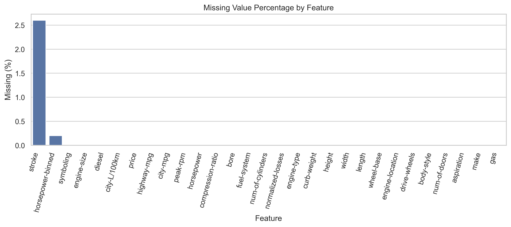
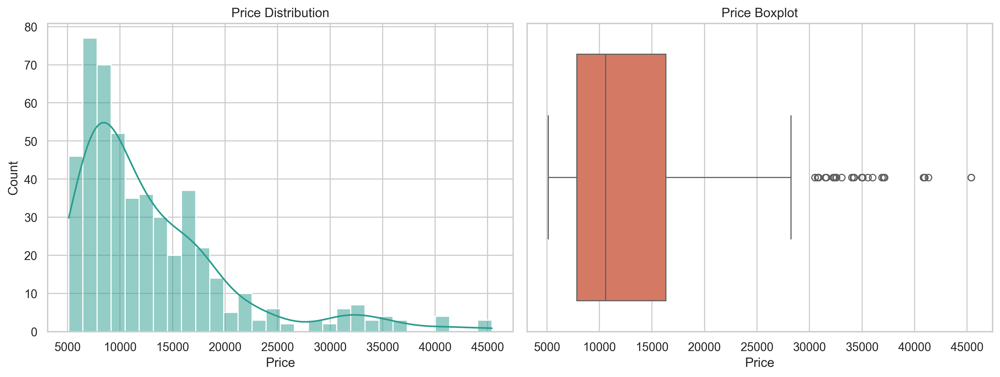
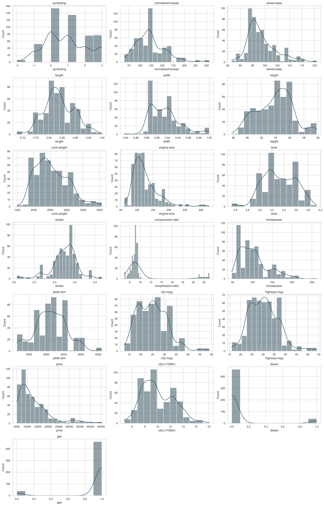
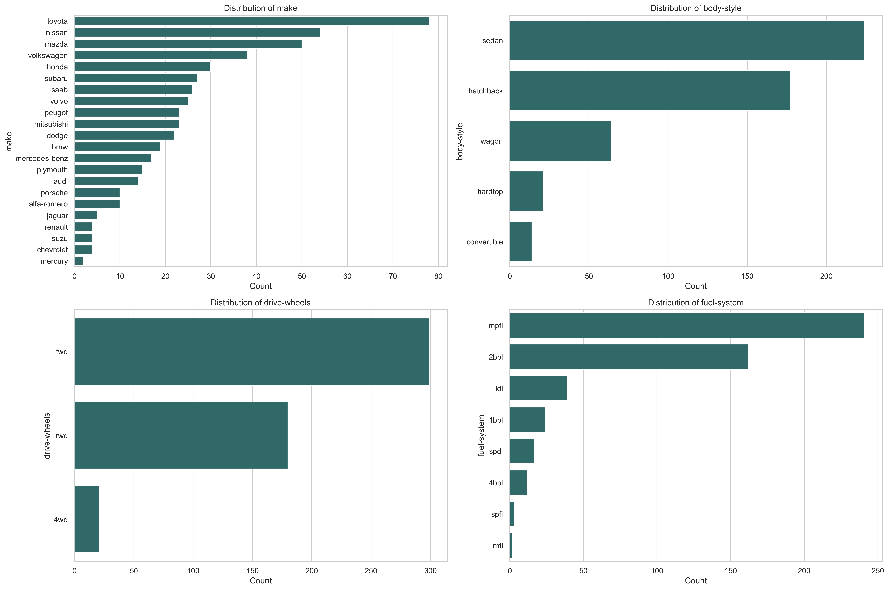
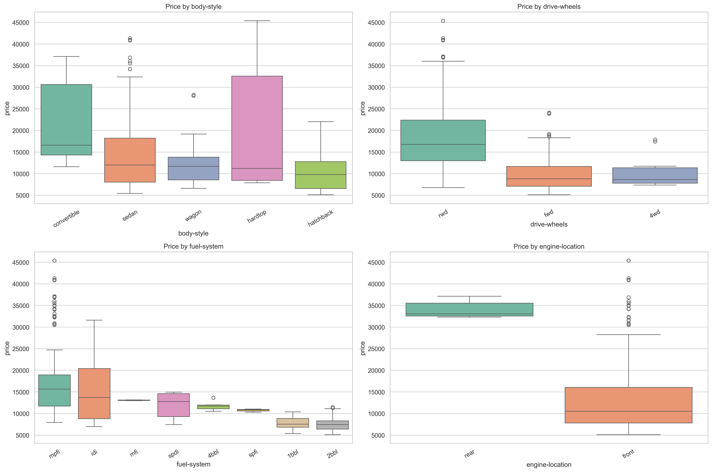
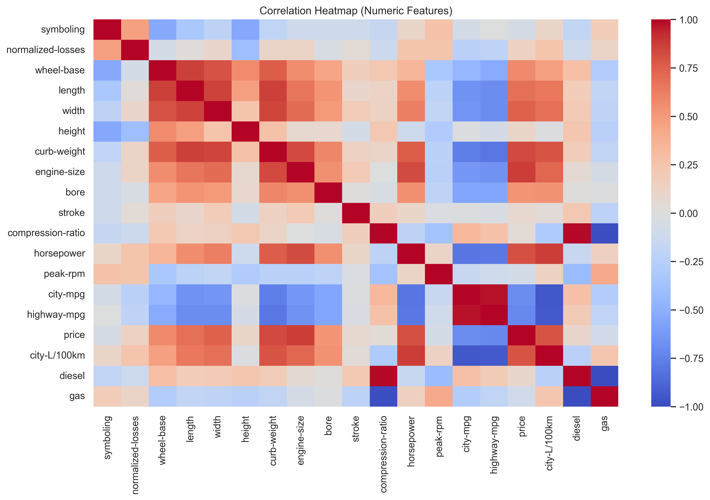
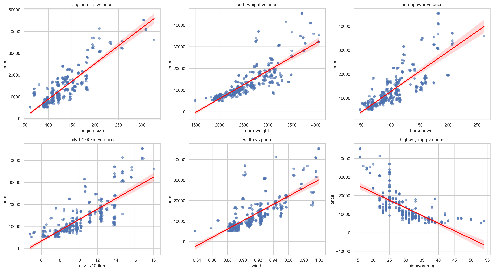

# EDA Output Previews and Quick Interpretations

This file provides a visual preview of all exported EDA charts from `01-eda/outputs/`, with a short interpretation for each.

## 1. Missing Value Percentage by Feature

**Interpretation:**
- Most features are complete, with only a few columns showing missing values.
- Missingness appears low and manageable, so targeted imputation should be sufficient instead of heavy row deletion.

## 2. Price Distribution and Boxplot

**Interpretation:**
- `price` is right-skewed, indicating more lower/mid-price cars and a smaller number of expensive cars.
- The boxplot suggests potential high-end outliers, which should be validated before modeling.

## 3. Numerical Feature Histograms

**Interpretation:**
- Numerical variables have mixed distribution shapes (some symmetric, some skewed).
- Feature scaling and optional transformation (for highly skewed variables) may improve model stability.

## 4. Categorical Feature Countplots

**Interpretation:**
- Category frequencies are imbalanced across several features.
- Rare categories may need careful handling (grouping or regularization-aware encoding) during modeling.

## 5. Price vs Categorical Features (Boxplots)

**Interpretation:**
- Price distributions differ clearly across key categories (for example, body style and drive wheels).
- Categorical variables are likely informative predictors for price estimation.

## 6. Correlation Heatmap (Numeric Features)

**Interpretation:**
- Several numeric variables are meaningfully correlated with `price`.
- Potential multicollinearity exists among some predictors, so model diagnostics (e.g., VIF/regularization) are recommended.

## 7. Top Regression Plots With Price

**Interpretation:**
- Top numeric features show visible linear/nonlinear relationships with `price`.
- These variables should be prioritized in baseline models and feature engineering steps.

## Summary

Overall, the outputs indicate:
- Good data quality with limited missingness.
- Strong predictive signal in both numeric and categorical features.
- Right-skewed target and possible outliers, which should be addressed in modeling strategy.
