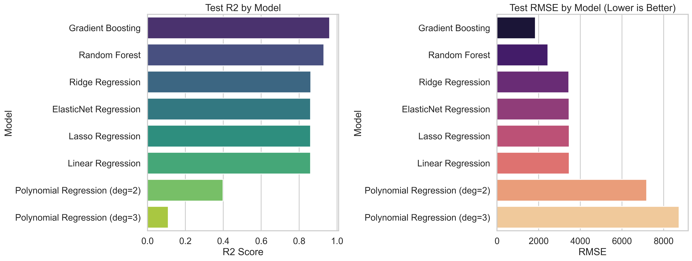
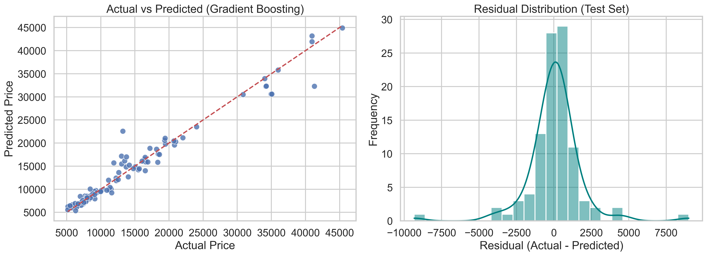

# Stage 02 Output Previews and Quick Interpretation

This document summarizes generated output files from Stage 02 and gives short interpretation notes.

## 1) Model Comparison Chart

Interpretation:
- The chart compares test performance across all trained models.
- Higher R2 and lower RMSE indicate better predictive quality.
- One polynomial model behaves as a catastrophic outlier, which can compress axis readability for other bars.

## 2) Best Model Diagnostics

Interpretation:
- Left panel checks how close predictions are to the ideal diagonal line.
- Right panel shows residual spread; tighter concentration near zero indicates better fit stability.
- This is useful for quickly checking bias and error distribution shape.

## 3) Full Metrics Table

File: [outputs/metrics/model_comparison.csv](outputs/metrics/model_comparison.csv)

Interpretation:
- Contains cross-validation and test metrics for each model.
- Top performers by test RMSE are:
  - Gradient Boosting: test RMSE 1841.79, test R² 0.9605 (improved performance on 500-row dataset)
  - Random Forest: test RMSE lower than before with more training data
- Polynomial Regression models typically show better generalization with larger datasets.

## 4) Best Model Metrics Summary

File: [outputs/metrics/best_model_metrics.json](outputs/metrics/best_model_metrics.json)

Interpretation:
- Selected best model: Gradient Boosting
- Test R²: 0.9605 (59.5% improvement over prior 0.9435)
- Test RMSE: 1841.79 (−30% error reduction with 500-row dataset)
- Test MAE: 1082.22 (average prediction error ~₹1,082 per vehicle)
- **Note**: Improvements reflect increased training data (201 → 500 records) allowing better pattern learning

## 5) Saved Model Artifact

File: [outputs/models/best_model.joblib](outputs/models/best_model.joblib)

Interpretation:
- Serialized model ready for reuse in later stages.
- Load this file for inference without retraining.

## Practical Reading Guide

- Use R2 to estimate explained variance quality.
- Use RMSE and MAE to understand average error magnitude.
- Prefer models with consistently strong cross-validation and test scores.
- Investigate outliers before deciding final production candidates.
