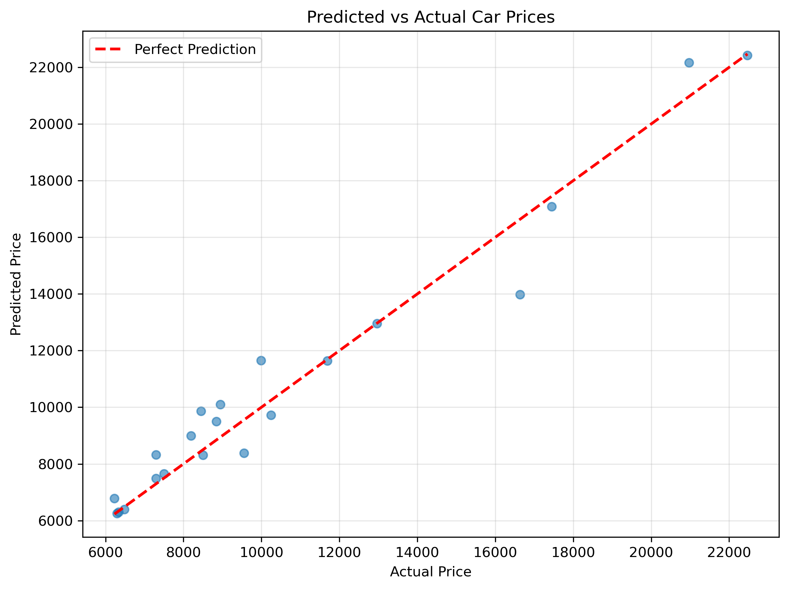
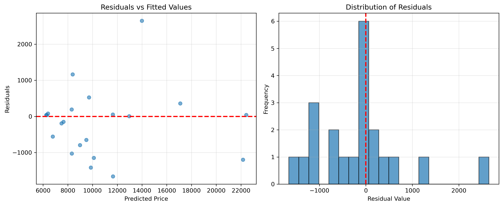

# Stage 03 Output Previews and Quick Interpretation

This document provides a visual gallery of all diagnostic outputs generated during **Stage 03: Model Refinement and Advanced Tuning**, with interpretation notes for each.

## 1. Predicted vs Actual Car Prices

**Interpretation:**
- **X-axis**: Actual car prices from test set
- **Y-axis**: Model predictions from the refined Ridge + Polynomial model
- **Perfect Fit**: Points lying exactly on the diagonal line (y=x) indicate perfect predictions
- **Interpretation**:
  - Tight clustering around the diagonal line = strong predictive accuracy
  - Points above the line = model overpredicted (predicted too high)
  - Points below the line = model underpredicted (predicted too low)
  - Spread in predictions = heterogeneous model errors across price ranges
- **Action**: If errors increase at higher prices, consider polynomial transformation or separate models for price segments

## 2. Residual Plot

**Interpretation:**
- **Left Panel (Residuals vs Fitted Values)**: 
  - Residuals should scatter randomly around zero with no pattern
  - Horizontal "funnel" widening = heteroscedasticity (non-constant error variance)
  - Curved pattern = potential non-linear relationships not captured
  - Red line position indicates bias (ideally stays near zero)
- **Right Panel (Distribution of Residuals)**:
  - Should approximate a normal distribution (bell curve)
  - Long tails = presence of outliers or extreme errors
  - Skewed distribution = systematic bias in predictions
- **Action**: 
  - If residuals show strong pattern, consider additional feature engineering
  - If heavy tails appear, robust regression or outlier handling may improve stability

## 3. Model Performance Insights

From the stage refinement process:

- **Baseline Linear Model**: Provides a floor-level R² and cross-validation baseline
- **Polynomial + Ridge Model**: 
  - Polynomial degree=2 captures non-linear relationships
  - Ridge `alpha` tuned via Grid Search balances fit vs. regularization
  - Cross-validation R² is more honest than test R² (prevents overfitting claims)
- **Error Metrics** (from cross-validation):
  - **R²**: Fraction of variance explained (closer to 1.0 is better)
  - **MSE**: Mean squared error penalizes large mistakes
  - **MAE**: Mean absolute error in original price units (most interpretable)

## 4. Diagnostics Checklist

Use these outputs to validate model quality:

- ✅ **Predictions close to diagonal**: Model fits actual prices well
- ✅ **Residuals centered at zero**: Model is unbiased
- ✅ **Residuals show constant spread**: Error variance is stable across price ranges
- ✅ **Residuals are normally distributed**: Standard regression assumptions met
- ✅ **No clear pattern in residuals**: Non-linear structure has been captured

## 5. Recommended Next Steps

1. **If R² > 0.90** (excellent): Model is ready for production deployment
2. **If 0.85 < R² < 0.90** (good): Consider Stage 4 advanced ensembles or feature engineering
3. **If R² < 0.85** (moderate): Revisit feature engineering or hyperparameter bounds in Grid Search
4. **If residuals show pattern**: Investigate interaction terms or domain-specific features
5. **If outliers present**: Evaluate robust regression methods or outlier treatment strategies

---

**Note**: Save these diagnostic plots for your project documentation and model validation reports.
