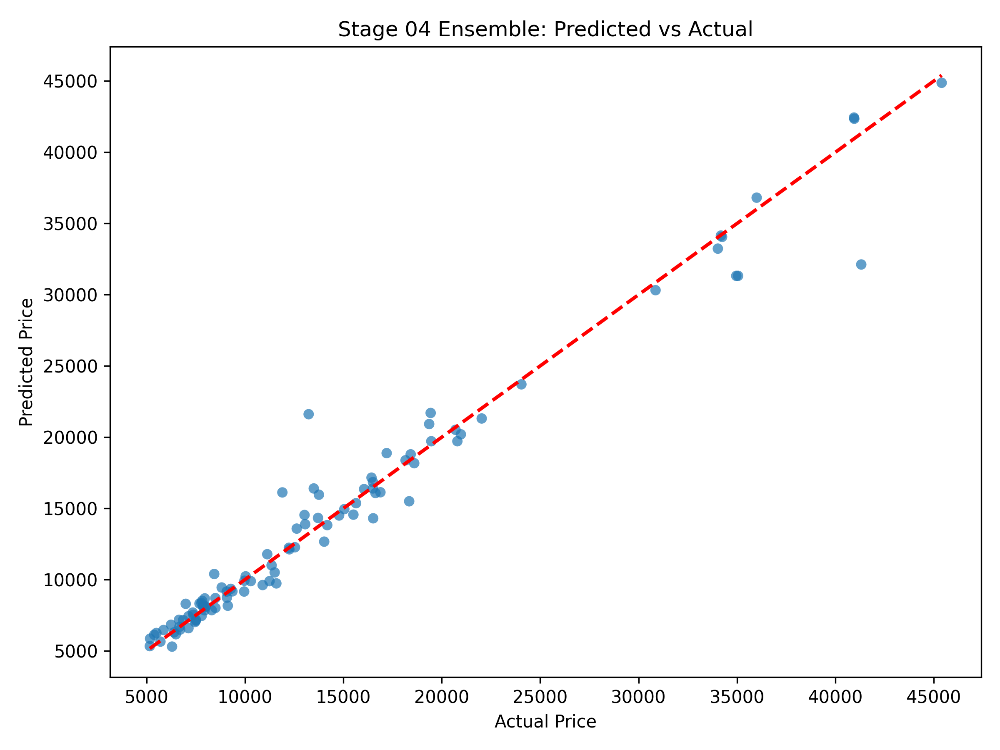

# Stage 04 Output Previews and Quick Interpretation

This document summarizes generated outputs from Stage 04 Ensemble Modeling and provides brief interpretation notes.

Data context:
- Stage 4 consumes cleaned data from Stage 1 (`01-eda/outputs/processed/usedcars_stage1.csv`)
- This stage focuses on ensemble strategies (blending and stacking)
- Outputs compare ensemble candidates against strong tree baselines

## 1) Ensemble Predicted vs Actual

Interpretation:
- Points near the diagonal indicate strong predictive alignment.
- Wider spread away from the diagonal shows larger prediction error.
- Useful as a fast visual check before reading numeric metrics.

## 2) Ensemble Model Comparison Table

File: [outputs/metrics/ensemble_comparison.csv](outputs/metrics/ensemble_comparison.csv)

Interpretation:
- Ranks Stage 04 candidates by test RMSE.
- Includes test R2, RMSE, and MAE for each candidate:
  - Gradient Boosting
  - Stacking Regressor
  - Weighted Blend (GBR/RF)
  - Random Forest
- Use this file as the main reference for Stage 04 model selection.

## 3) Best Ensemble Metrics Summary

File: [outputs/metrics/best_ensemble_metrics.json](outputs/metrics/best_ensemble_metrics.json)

Interpretation:
- Selected best model: Gradient Boosting
- Test R2: 0.9676
- Test RMSE: 1667.09
- Test MAE: 923.55
- Best blend weight found for GBR in weighted blend: 0.9
- RMSE delta vs Stage 02 best: -174.70 (improvement)

## 4) Saved Best Model Artifact

File: [outputs/models/best_ensemble_model.joblib](outputs/models/best_ensemble_model.joblib)

Interpretation:
- Serialized winning model for reuse in inference and downstream stages.
- Load this artifact to predict without retraining.

## Practical Reading Guide

- Prioritize lower RMSE for pricing error quality.
- Use MAE for directly interpretable average error size.
- Use R2 to assess overall explanatory strength.
- Confirm visual fit and numeric metrics together before selecting a final model.
