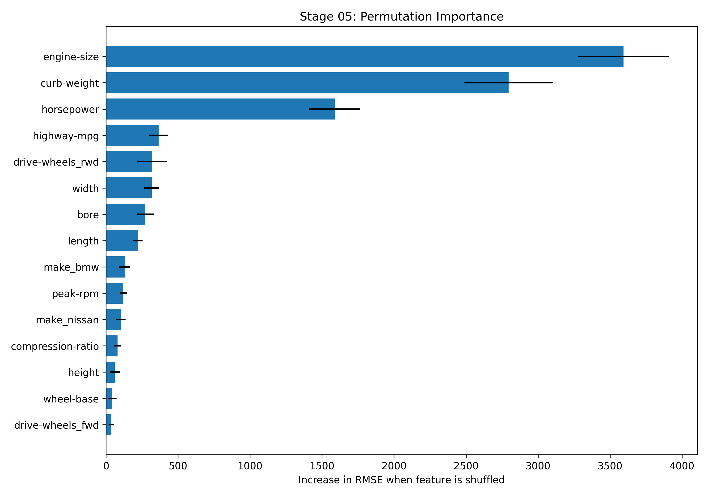
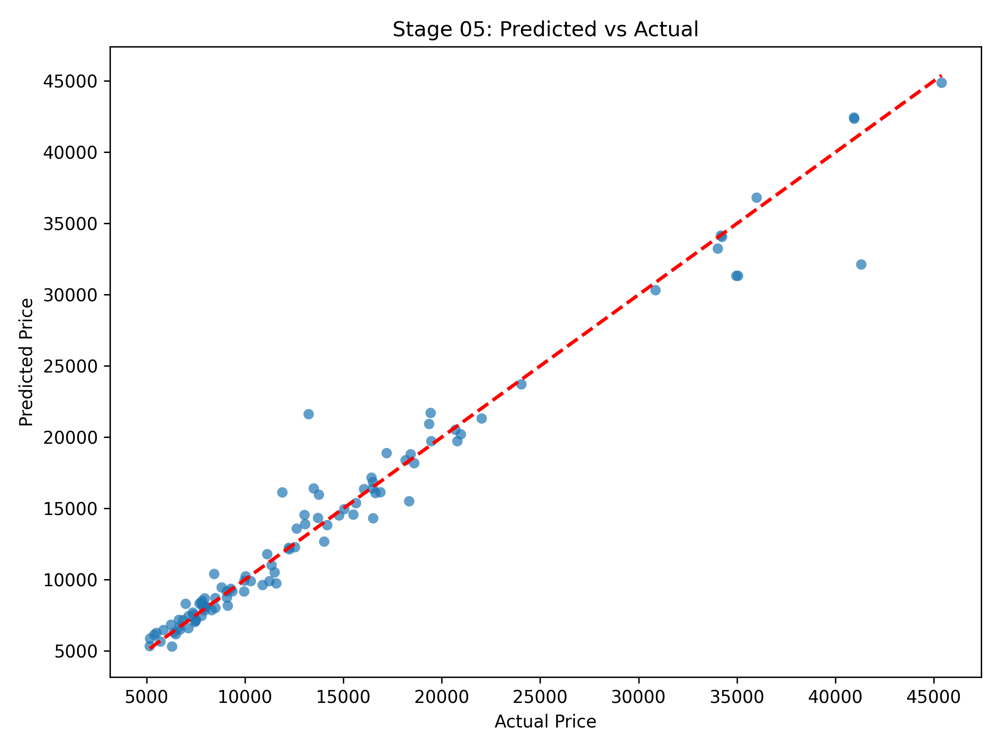

# Stage 05 Output Previews and Quick Interpretation

This document summarizes the outputs generated by Stage 05 and gives short interpretation notes.

Data context:
- Stage 05 uses the cleaned Stage 1 dataset and a retrained Stage 05 compatible model
- The main purpose is model interpretation and feature influence reporting

## 1) Feature Importance Plot

Interpretation:
- Higher bars indicate features that cause a larger RMSE increase when shuffled.
- These are the features the model depends on most for prediction quality.
- Use this chart to explain which variables are driving price predictions.

## 2) Prediction Scatter Plot

Interpretation:
- Points close to the diagonal line mean predictions are close to actual values.
- Spread away from the line shows larger prediction error.
- This is a quick visual check that the explainable model still performs well.

## 3) Feature Importance Table

File: [outputs/metrics/feature_importance.csv](outputs/metrics/feature_importance.csv)

Interpretation:
- Contains the full ranking of features by permutation importance.
- Includes mean and standard deviation across repeated shuffles.
- Use this as the source file for written explanations and UI summaries.

## 4) Stage 05 Metrics Summary

File: [outputs/metrics/stage5_model_metrics.json](outputs/metrics/stage5_model_metrics.json)

Interpretation:
- Stores Stage 05 model performance and top feature list.
- Also records the difference from Stage 04 RMSE for comparison.

## 5) Saved Stage 05 Model

File: [outputs/models/stage5_explainable_model.joblib](outputs/models/stage5_explainable_model.joblib)

Interpretation:
- Serialized model used for inference and downstream stages.
- Load this artifact for inference without retraining.
